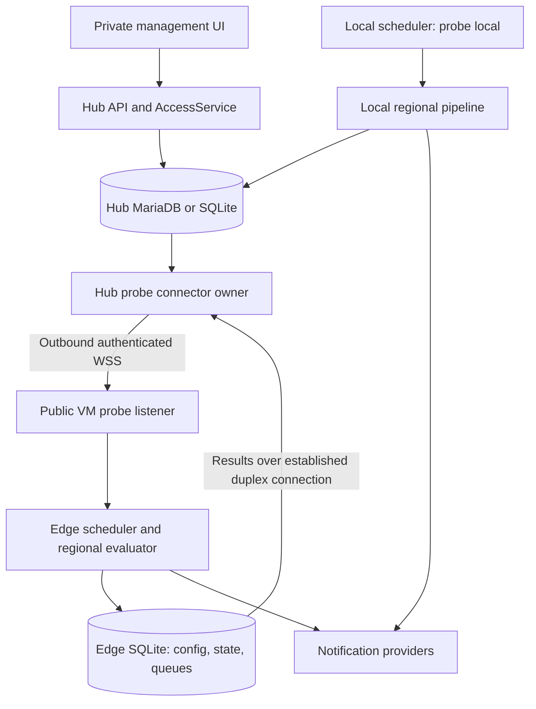

# Multi-region probes — architecture

Status: proposed. Baseline and precedence are defined in [the handoff index](README.md). The concrete wire contract is in [PROTOCOL.md](PROTOCOL.md), and delivery gates are in [IMPLEMENTATION_PLAN.md](IMPLEMENTATION_PLAN.md).

## 1. Requirements and guarantees

Phoenix must support a private Kubernetes hub with outbound Internet access and zero public inbound endpoints, plus public VM probes running the same Go checker and notifier implementations. An operator can assign an internal target only to `local`, an external target only to a remote probe, or a shared target to several probes. Each probe measures and alerts from its own network perspective.

The following guarantees are required:

1. An enrolled probe continues its accepted checks, maintenance evaluation, and direct notifications after losing the hub, including across a probe process restart with an intact data directory.
2. Each regional result is attributed to an authenticated probe and an authorized assignment generation. A probe cannot submit results for arbitrary monitor IDs.
3. Remote UP results cannot reset another probe's retries, close another regional incident, or overwrite its certificate/capacity state.
4. Acknowledged telemetry survives a hub process crash under the configured database durability guarantees. Retried telemetry does not count twice.
5. Historic replay updates history and aggregates without producing obsolete live notifications.
6. Defaults preserve today's local-only installation. A remote deployment needs no direct access to the hub database or Redis.
7. The UI identifies stale evidence, configuration lag, queue pressure, and uncertain notification delivery.

There is no guarantee of immediate failure detection, exactly-once delivery through every external notification provider, or unlimited offline history on finite disk. Alert delivery requires the probe to reach its configured provider. Control-plane availability during total hub failure and cross-region database replication are separate scope.

## 2. Deployment and topology

### 2.1 Network contract

- The hub initiates the TCP/TLS/WebSocket connection. Both participants send data after it is established. The probe does not try to dial a private hub address on reconnect.
- Default example listener is `:8443`; the endpoint is configurable, including `:443`. Kubernetes NetworkPolicy, enterprise egress rules, DNS, proxies, and VM firewalls must permit the selected path. NAT alone does not imply that permission exists.
- A VM needs one inbound runtime listener. Optional SSH installation additionally needs temporary or managed inbound SSH access; it is not covered by the runtime port.
- The V1 listener serves the probe protocol and minimal health routes. It exposes no admin dashboard, registration API, configuration export, or arbitrary command runner.
- WebSocket ping/pong detects transport liveness. Application health messages additionally report scheduler health, durable-ingest readiness, and progress. A responsive socket does not prove the hub can save data.
- Reconnect uses exponential backoff with full jitter, from 1 second to a 30-second cap. Reset backoff after 30 seconds of healthy operation. All loops stop on context cancellation.

### 2.2 Process modes and packaging

The current application gates `all`, `api`, and `worker` in `internal/bootstrap/run.go`. `probe` is a new mode requiring explicit wiring and configuration validation. Add `cmd/probe/main.go` as a dedicated executable entry point using the same modules; the all-in-one app may also dispatch `MODE=probe` before hub bootstrap. A probe must not create users, require a JWT secret, start hub rollups, or connect to MariaDB/Redis.

Keep existing all-in-one and split API/worker image behavior. A probe artifact must use the worker-compatible checker/notifier runtime, an edge SQLite directory, and its own listener. It need not carry frontend assets. An optimized image is optional; shared implementation is required.

Hub connector ownership runs in `all` or `worker`, never on every API replica. It uses the existing configured hub database for a per-probe connection lease. Redis remains only the optional intra-hub event bus; WAN data never relies on it.

### 2.3 Logical identity and ownership

| Identity | Lifetime and purpose |
|---|---|
| `hub_id` | Stable installation UUID in the hub database; identifies the authority whose configuration a probe accepts |
| `probe_id` | Stable public identifier for a vantage point; reserved `local` for today's execution site |
| `worker_id` | Replaceable executor within one hub deployment; never used as regional identity |
| `stream_id` | Random persisted epoch for one probe's telemetry sequence; survives ordinary process restarts |
| `seq` | Monotonic positive signed 64-bit counter within that stream; allocated transactionally on SQLite, encoded as a decimal string on the wire; zero is reserved for the initial cursor |
| `assignment_generation` | Increases when an assignment is removed/recreated or its execution identity changes; rejects stale work |
| `connection_generation` | Hub DB fencing token increasing on connector takeover; prevents old owners issuing commands |

One running process may own one edge data directory. Enforce an exclusive process lock. Running two copies of the same probe identity with copied SQLite files is unsupported and must trigger a duplicate-session diagnostic. A replacement VM enrolls with a new stream epoch through an explicit reset flow; it never silently resets a sequence to zero.

For local HA, multiple workers can share the `local` vantage using DB-leased monitor assignments. Remote probes own their assigned execution locally; a hub worker losing a lease must never steal checks assigned solely to a remote vantage. Connector failover and check execution are separate leases.

## 3. Hexagonal integration

### 3.1 Existing seams verified against the application

| Current source | Consequence for this feature |
|---|---|
| `internal/core/services/heartbeat_service.go`, `Record(ctx, monitor, result)` | Constructs `Time` from now, derives retries from `GetLatest(monitor.ID)`, dispatches immediately; not an API for ingesting pre-evaluated remote history |
| `internal/core/services/notification_dispatcher.go` | Availability attempt throttles now use monitor/probe/generation; the dispatcher rejects remote heartbeats. Lifecycle binds the heartbeat assignment; escalation inherits incident identity and checks current local ownership before delivery |
| `internal/adapters/repository/{mariadb,sqlite}/repo.go` | Latest/history readers and rollup persistence currently have one monitor dimension |
| `internal/adapters/repository/mariadb/migrations/001_init.up.sql` | Heartbeats use second-precision partitioned time; rollups have an auto-increment ID and a separate unique `(monitor_id,bucket)` key |
| `internal/adapters/scheduler/{local,sharded}.go` | Monitor scheduling and leases require assignment-aware filtering |
| `internal/core/services/{certificate_alert_service,monitor_condition_service}.go` | Auxiliary state and notification suppression also need regional identity |
| `internal/core/services/{monitor_stats_service,monitor_group_service,insights_service}.go` | Consumers need explicit regional or aggregate semantics, preserving current batched-query performance |
| `internal/adapters/ws/{events,wire}.go` | Browser protocol and wire mapping are separate from internal bus payloads; extend both |
| `internal/core/services/{configascode_types,backup_service}.go` | Assignments need portable identifiers, export/import rules, and secret handling |

### 3.2 New responsibilities

Pure types belong in `internal/core/domain/`: Probe, ProbeAssignment, RegionalObservation, RegionalState, ProbeStatus, StreamCursor, ScopedAlertIdentity, and aggregate-health policy. No JSON tags, socket objects, SQL types, or encryption code belong there.

Add narrow ports only where two adapters or a meaningful test fake need them:

| Port responsibility | Required operations, each with context for I/O |
|---|---|
| Probe registry | Get/list/create/update registration, with secrets excluded from public views |
| Assignment repository | Read/replace effective assignments and generations atomically |
| Regional commit | Atomically commit observation, state transition, stream record, and notification intent |
| Remote ingest | Atomically deduplicate a batch, store history/mirrors, update cursors, and mark aggregates dirty |
| Probe configuration store | Read and install a complete versioned snapshot atomically |
| Durable queue | Read batches, acknowledge ranges, and persist declared retention gaps |
| Connector lease | Acquire/renew/release with generation fencing |
| Probe transport | Open a session, send a typed application message, and close it |
| Credential store | Read/write/rotate protected connection credentials |

Keep interfaces small; do not make a single probe repository responsible for transport, SQL transactions, cryptography, and notification delivery. Multi-write transactions are exposed as explicit atomic domain operations implemented by adapters, not raw database handles passed into services.

Use services for ProbeService, ProbeConfigService, RegionalCheckService, ProbeIngestService, ProbeHealthService, and MonitorHealthService. Existing checker and notifier interfaces remain reusable. Implement TLS/WebSocket in `internal/adapters/probe`, edge persistence in `internal/adapters/repository/edge`, and secret protection in an auth/security adapter. Composition happens through command/bootstrap wiring.

### 3.3 Two recording paths

**Local or edge evaluation:** schedule assigned work, run a checker, normalize the result, evaluate regional retries/conditions/maintenance, and atomically store the observation, regional state, incident transition, and durable notification intent. Publish UI/event-bus hints only after commit. Notification I/O runs outside the database transaction and outside shared locks.

**Hub remote ingest:** authenticate the connection; authorize assignment identity; validate the already-evaluated observation and its bounds; persist it idempotently with original observation time; update permitted projections and historical aggregates; mirror regional alert/delivery events. Never call the current `HeartbeatService.Record` on a remote payload. Never repeat provider delivery for a mirrored regional event.

The local-only path must preserve its public behavior and regression tests. Refactor shared retry/condition evaluation into a pure service operation before adding remote transport, so local and remote execution follow one rule set.

## 4. Regional and overall health

### 4.1 Regional state

The authoritative key is `(monitor_id, probe_id, assignment_generation)`. Track the last sequence, observed time, accepted config revision, effective status, consecutive failures, active alert identity, last successful check, and freshness separately.

- Preserve existing `DOWN=0`, `UP=1`, `PENDING=2`, `MAINTENANCE=3`. Add `UNKNOWN=4` explicitly; update every exhaustive consumer before emitting it on existing routes or browser events. The foundation may reserve the value without changing legacy wire mappings. Never renumber stored values.
- Preserve current retry semantics: DOWN becomes confirmed only when consecutive failures exceed `max_retries`; retries remain PENDING. `upside_down` and accepted HTTP codes retain their present behavior.
- Default result freshness is `max(90, 2 * max(interval, retry_interval) + ceil(timeout))` seconds. Freshness concerns observed check age, not receipt of an arbitrary WebSocket message.
- A disconnected probe may still have fresh last-known evidence until that deadline; display its disconnected connection state separately. At the freshness deadline, the hub projects UNKNOWN. The initial pure evaluator treats future-dated observations as UNKNOWN until their timestamp is reached, and permits an explicit diagnostic to invalidate otherwise recent evidence.
- Maintenance is evaluated from accepted configuration. It suppresses notifications and appears explicitly; it never resets another region's incident history.
- Administrative pause is a separate execution state. Paused assignments do not participate in quorum and do not masquerade as failing probes.
- Significant clock error, missing assignment acknowledgement, a retention gap covering the current evidence, or execution failure can make a regional view UNKNOWN with a reason.

### 4.2 Aggregate policy

V1 supports `any_down` and `all_down` for displayed monitor health. `any_down` is the default. The eligible set contains active, assigned probes; maintenance and explicitly paused assignments are handled separately, while stale assignments remain UNKNOWN and cannot be silently discarded to make an ALL policy pass.

| Evidence | `any_down` | `all_down` |
|---|---|---|
| All eligible evidence fresh UP | UP | UP |
| At least one confirmed DOWN and at least one UP | DOWN | UP |
| All eligible probes confirmed DOWN | DOWN | DOWN |
| DOWN plus UNKNOWN/PENDING, no UP | DOWN | UNKNOWN if any UNKNOWN; otherwise PENDING |
| UP plus UNKNOWN/PENDING, no DOWN | UNKNOWN if any UNKNOWN; otherwise PENDING | UP |
| All evidence UNKNOWN | UNKNOWN | UNKNOWN |
| All evidence PENDING | PENDING | PENDING |
| UNKNOWN mixed with PENDING, no confirmed UP/DOWN | UNKNOWN | UNKNOWN |
| All assigned probes in maintenance | MAINTENANCE | MAINTENANCE |
| All assignments administratively paused | UNKNOWN with `no_active_assignments`; display execution paused | UNKNOWN with `no_active_assignments`; display execution paused |
| No assignments | Reject configuration; never return a healthy empty quorum | Reject configuration |

For mixed maintenance and active assignments, evaluate the active set; disclose the maintenance count. An `all_down` UP with one working region and one failed region still exposes degraded regional coverage in the view. The overall policy determines service availability; regional failures remain visible and may page independently.

Keep the last confirmed incident through UNKNOWN or PENDING. Neither state sends a recovery. Recovery requires a fresh policy-satisfying UP. A policy or assignment change is an administrative recalculation, not evidence that a target recovered; it closes an obsolete aggregate incident with an administrative reason and evaluates subsequent fresh evidence before creating a new one.

### 4.3 History, latency, and uptime

Regional charts read a selected probe. Overall charts use derived availability intervals, not a union of raw heartbeats from several probes. Do not average all probe samples into a single uptime percentage: faster intervals and more probes would change the denominator.

Report `uptime_percent` over known UP/DOWN duration, plus `coverage_percent` and explicit unknown/maintenance duration. Define known duration as UP + DOWN and unknown duration as UNKNOWN + PENDING + administratively paused duration. Coverage is `100 * known / (known + unknown)`; maintenance is excluded from both percentages. Return null uptime when there is no known duration, and null coverage when its denominator is zero (including an all-maintenance or zero-length window). Count each assigned probe in exactly one state bucket, including an explicit paused bucket. Keep per-region latency series; V1 does not invent an aggregate ping from incomparable vantage points.

Historical overall status is reconstructed from regional transitions, assignment/policy effective-time history, and freshness expirations. Late data can improve the historical answer but cannot rewrite the fact that operators had missing evidence at the time; retain receipt time for diagnostics. Do not let added probes retroactively participate in periods before their assignment.

Assignment history stores a complete membership snapshot per set revision on `[started_at, ended_at)`. Replacement closes all previous members and opens the new set at one UTC microsecond boundary in the same transaction, preserving generations of retained members. Policy-only changes also create a revision. No-op and failed replacements create none. Boundaries increase even if the hub clock moves backward. Migration `040` can recover only the current set starting at its last edit; it cannot infer earlier removed members or policies. Missing historical membership contributes UNKNOWN duration with `missing_assignment_history`, zero counts and revision zero (the `any_down` policy field is a placeholder, not evidence of an old policy). The fallback to legacy local membership applies only when no assignment set exists.

Latest current state is selected by authenticated stream/assignment identity and monotonic sequence, not the hub insertion ID. Ordered historical rows still use deterministic `time, id` tie-breaks within a region. Stream sequencing determines same-probe state even if the wall clock moves backward. Reject unreasonable future times from live projection, preserve diagnostic evidence, and avoid negative duration intervals.

## 5. Alert ownership and incident lifecycle

### 5.1 Default policy

Each probe delivers its own regional availability, certificate, and capacity alerts in both connected and disconnected modes. The hub mirrors these records for inspection. The local probe follows the same ownership rule. Add region name, scope, source incident ID, and check time to alert context without changing provider interfaces.

Default monitor delivery mode is `regional`. Aggregate monitor paging is a follow-on option with explicit `aggregate` or `both` selection. Hub folder alerts remain hub-owned and derive from overall monitor health. A regional recovery cannot resolve a folder or public status-page incident unless the overall recovery policy is satisfied.

Use `(scope, monitor_id, probe_id, source_alert_id)` as the logical incident identity; hub mirror IDs are distinct from source IDs. Scope values are `regional`, `aggregate`, and `probe_connection`. The existing group-alert mechanism keeps its group identity. Certificate and condition incidents also include their condition/threshold identity.

This delivery scope is a new field, separate from the current `AlertContext.AlertScope` / `alert.scope` template variable, whose `monitor` and `group` meanings must remain compatible. Add `alert.delivery_scope`, `alert.source_id`, `probe.id`, `probe.name`, and `probe.location` variables. A connection-watchdog alert uses an explicit probe entity context, never a fabricated monitor row or an invented checker type.

Migration 044 adds probe/generation identity to availability alerts and composite open-incident uniqueness. Existing rows backfill to local generation one, preserving IDs, tokens, times and child escalation progress. Unbound compatibility reads list local history and resolve open incidents only for the active local generation. Bound repositories address an exact assignment. A retained local token affects only its original incident; remote token lookup is disabled. Hub escalation claims exclude remote incidents and the runner cancels obsolete local generations before sending. Removed assignment incidents remain retained history, without inventing a recovery. Storage binding does not authenticate or authorize an executor.

### 5.2 Durable delivery

Persist incident changes and delivery intents with check state before attempting I/O. Delivery intents have stable IDs, channel identity/version, incident identity, event kind, attempt count, next attempt time, and outcome. Retry transient errors with bounded exponential backoff; permanent provider validation failures become visible failed delivery records. Secret rotation is versioned so queued intents do not leak or resurrect removed credentials.

V1 availability beats and notification intents are separate queues. Provider unavailability cannot block recording checks or telemetry replication. After a process crash following provider acceptance but before local acknowledgement, a duplicate external notification is possible unless that provider supports a usable idempotency key. Do not claim exactly-once external delivery.

When an old DOWN notification remains queued after its incident has resolved, replace unsent obsolete availability/resend intents with one delayed incident summary containing outage and recovery times. Never send an old DOWN followed by a misleading current recovery storm. Certificate and capacity notifications similarly re-evaluate whether the condition still warrants delivery.

The M1 storage subset (`045`) implements `probe_delivery_intents` separately from
`probe_delivery_events`. Both regional recording ports can commit an optional
availability incident transition and up to 100 channel intents with the check.
The local port also includes heartbeat and sequence allocation. Intent identity,
assignment, source stream/sequence, check output/time/status, and outage timing
are captured together. Channel versions equal the accepted config revision;
storage checks that equality but does not construct or authorize configuration.
Mirroring outcomes cannot enqueue work or complete source-owned work.

Claims are scoped to one probe and the current assignment generation, ordered by
due time, creation time, then delivery ID. They reserve at most 100 rows for up
to 15 minutes, with a fresh opaque token and monotonically increasing attempt.
SQLite locks the writer before reading; MariaDB uses ordered row locks with
`SKIP LOCKED` and a scalar assignment lookup to avoid locking a shared assignment
through a semijoin. Completion checks the token, attempt and lease interval and
atomically writes the outcome and queue state. Identical completion receipts are
idempotent; a stale or conflicting receipt fails. Queue times use UTC microseconds
on both engines. Retrying results require a later due time and a bounded diagnostic
code; no raw provider errors or provider credentials are persisted in this queue.

This is a storage contract, not an enabled delivery worker. The live local
dispatcher still uses its existing alert and throttle paths. Before switching it,
implement versioned channel/config ownership, local alert-to-source identity
mapping, transactional lifecycle/resend/escalation planning, obsolete-intent
supersession and delayed summaries, and a consumer that revalidates lifecycle,
assignment and channel version before I/O. A claim does not fence I/O already in
flight or decide whether a pending DOWN remains worth sending. Retry backoff,
provider error classification, auxiliary intents and remote activation remain
later integration. No exactly-once external delivery guarantee follows from a
lease receipt.

### 5.3 Acknowledgement and escalation

Regional acknowledgement requested through the hub is a durable, idempotent command to the owning probe. The hub returns a command receipt and displays `pending` until the probe confirms applying it. During a partition, an operator cannot assume a queued acknowledgement has already stopped remote resends/escalations. Include a warning next to that pending state in the UI.

Probe acknowledgement state and escalation progress survive restart. The edge runs applicable accepted escalation policy and monitor-channel configuration; group-wide escalation remains hub-owned. Commands carry source incident identity and assignment generation, so a delayed acknowledgement cannot acknowledge a new outage. An incident already resolved returns an idempotent `already_resolved` result.

Existing local acknowledgement links use opaque database tokens, not signatures, and retain their behavior. Remote regional acknowledgement URLs are deferred from V1: omit them from remote notifications, even when the channel requests a link. Use the authenticated hub command after the source incident has been mirrored. A future link mechanism must define scoped authority, expiry, and offline-created incident lookup before activation; never distribute a hub-wide signing secret to probes. Surface this limitation in remote channel configuration.

## 6. Watchdogs and offline operation

Send control health every 15 seconds. A link is suspect after 45 seconds without valid application health and disconnected after 90 seconds. Require 30 seconds of continuous valid health before a watchdog recovery notification. These are defaults, not sub-second promises.

| Condition | Probe behavior | Hub behavior |
|---|---|---|
| Healthy session and current configuration | Checks and direct regional delivery; streams results | Saves history; projects health; shows configuration applied |
| Transport lost | Continue accepted work; start outage clock | Show disconnected transport; age evidence toward UNKNOWN |
| Socket alive, hub durable ingest unhealthy | Keep telemetry on disk; alert on sustained hub service failure | Do not acknowledge uncommitted events; report degraded ingestion |
| Probe process restarts offline | Load persisted identity/config/state/queues; resume scheduler and watchdog | Keep evidence freshness policy |
| Hub returns | Authenticate, reconcile config and commands, send current snapshot, replay history | Restore fresh views promptly; ingest history without regional redelivery |
| Probe disk nearly full | Evict eligible old history through declared gaps; reserve space for state/transitions; alert queue pressure | Surface gap and reduced coverage |
| Probe disk cannot commit critical state | Mark execution/persistence unhealthy; do not report checks durably recorded; attempt bounded emergency delivery and expose degraded state | Expire old evidence; show probe execution unhealthy |
| Probe revoked while partitioned | May continue last accepted work until it learns revocation or credentials are disabled externally | Reject credentials/data immediately; mark revocation unconfirmed remotely |

The connection watchdog arms after first successful configuration activation, or after restart of a previously activated probe. A brand-new unenrolled installation does not page about a hub it has never known. Persist open watchdog identity to avoid startup duplicates.

Global maintenance pause and revocation cannot be delivered magically through a partition. Use last accepted schedules, prominently expose stale configuration, and require provider-side credential revocation for an emergency stop against an unreachable or compromised VM.

## 7. Persistence and migration design

### 7.1 Hub logical schema

This is the target schema contract, not ready-to-run migration SQL. Implementation must use the next free migration numbers in both adapters.

| Table or extension | Keys and material columns |
|---|---|
| `probe_installation` | Singleton `hub_id`, protocol floor, configuration authority epoch |
| `probes` | `id` PK, unique human `key`, name, location, kind (`local`/`remote`), endpoint, enabled/revoked timestamps, certificate pin, encrypted credential/version, runtime status, last seen, applied/desired revisions |
| `monitor_probes` | PK `(monitor_id,probe_id)`, active, generation, assigned time, desired/applied config revision |
| `monitor_probe_assignment_history` | Monitor/probe/generation, effective-from/to UTC, policy revision; supports historical aggregation; historical ingest authorization remains to be wired |
| `probe_sessions` | Probe ID, connector owner, lease expiry, connection generation; transactional fencing |
| `probe_local_sequence` | Singleton local-stream high-water mark; allocated with the heartbeat/observation/state transaction and retained after monitor/history deletion |
| `probe_streams` | PK `(probe_id,stream_id)`, current/retired epoch, contiguous committed cursor, retirement time, declared gap records |
| `monitor_probe_state` | PK `(monitor_id,probe_id)`, generation, stream/seq, observed/received time, effective status, counts, freshness reason, config revision |
| `probe_config_snapshots` | PK `(probe_id,revision)`, canonical bytes hash, schema version, protected snapshot, desired/acknowledged state, activation time |
| `probe_commands` | Command UUID PK, probe/incident identity, kind, protected payload, expiry, applied result, attempts |
| `probe_delivery_events` | Unique source delivery-event identity, source incident/probe, status, redacted error, observed time |
| `probe_delivery_intents` | Source-owned availability identity and immutable check/incident context, channel/config version, due time, attempt/token/lease, latest result; never populated by replay |
| `monitor_health_state` | Monitor PK, policy, version, overall status, freshness/coverage counts, last transition, projection cursor |
| `monitor_health_history` | Monitor/time/id ordered overall availability transitions, cause, policy revision; retain UNKNOWN and administrative changes |
| `monitor_conditions` | PK `(monitor_id,probe_id,assignment_generation,kind)`; latest measurement, candidate/promotion count, freshness, last-success and notification cursor |
| `tls_info` | Preserved auto-increment ID; unique `(monitor_id,probe_id,assignment_generation)`; certificate metadata and sent-threshold cursor |
| `notification_throttles` | PK `(monitor_id,probe_id,assignment_generation)`; durable UTC `last_attempt_at` for availability attempt backoff |
| `probe_dirty_buckets` | Unique monitor/probe/resolution/bucket or overall-monitor bucket; durable late-data recomputation work |

Extend raw heartbeats with `probe_id` (backfill/default `local`), nullable `stream_id`/`source_seq` for legacy rows, `assignment_generation`, `received_at`, and config revision. Keep current IDs and second-precision `time` partitioning. Index `(monitor_id,probe_id,time,id)`. A global source-event unique key that omits the partition time cannot simply be added to MariaDB's partitioned heartbeats table; deduplication belongs in transactional stream cursors/receipts outside that table.

The M1 local recorder implements one durable sequence for the shared `LocalStreamID`, not one counter per monitor. Migration `042` seeds its high-water mark from retained observations, state, and heartbeat source sequences. Allocation first takes a database write lock, then checks the assignment and expected state sequence and atomically writes heartbeat, observation, state, and dirty buckets. Failed writes roll back allocation. Stale state causes service re-evaluation with a fixed check result/time and assignment generation; missing/obsolete assignments fail. MariaDB assignment and state reads use current row locks; SQLite obtains the writer lock before reading. Local hints and provider work begin only after commit. The counter is independent of monitor deletion and retention; downgrade refuses to discard a nonzero value. Explicit local-stream commits also advance it; remote ingest cannot claim the reserved local identity. Migration `045` extends both source recording ports with optional availability incident transitions and delivery intents in that transaction. The live `HeartbeatService.Record` does not yet supply them; its alert lifecycle and delivery remain on the legacy dispatcher. Auxiliary state and overall projection remain outside this boundary.

V1 accepts a single ordered telemetry sequence per stream. The ingest transaction locks its stream cursor, verifies the next contiguous sequence or a declared gap, inserts new events, updates mirrors/dirty buckets, and advances the cursor. Duplicate prefixes at or below the cursor are no-ops. Reject gaps not explicitly declared. This avoids an unbounded per-heartbeat dedup ledger while preserving acknowledgement semantics. If a later version permits unordered parallel batches, it must first add a durable receipt design.

Extend rollups with `probe_id` and coverage fields. Preserve `id` as the auto-increment primary key. Replace the existing `uq_monitor_bucket` with `(monitor_id,probe_id,bucket)` and update upsert/query predicates. The original research's primary-key replacement leaves the old unique constraint intact and mishandles the auto-increment key.

Scope regional alerts, certificate state, capacity conditions, escalation assignments/progress, and delivery suppression by probe as well as monitor. Existing rows backfill to `local`. Do not silently reinterpret existing monitor-wide incident IDs; maintain compatible IDs and explicit scope mapping during migration.

The M1 auxiliary slice (`041`) implements capacity and certificate identity without enabling remote delivery. Repository views bind both probe ID and assignment generation and reuse the existing local algorithms. Compatibility reads select only the current active local assignment, or generation one for a legacy monitor without an assignment set. Bound condition deletion is assignment-specific; unbound monitor configuration cleanup removes all generations. Historical generations remain separate and never seed a new assignment's thresholds or promotion counters. Legacy rows backfill to generation one even if the desired assignment has since changed. Downgrade refuses remote or later-generation auxiliary rows; perform schema changes with all application writers stopped.

Local `Record` binds metadata persistence and auxiliary evaluation to the assignment that produced the heartbeat. Alert context carries regional ownership separately from its legacy monitor/group scope. Remote updates are excluded from the legacy monitor-only condition event. This slice retains best-effort auxiliary writes after the regional observation commit; atomic check/condition/incident/outbox recording, template region labels, regional event consumers, and accepted edge configuration remain required before enabling remote execution.

Migration `043` adds durable availability attempt throttles, wired to the local dispatcher in both engines. `Reserve` serializes eligibility and cursor updates in one transaction before provider I/O, including across independent connections. Maintenance, acknowledgement, and disabled resends consume no cursor; recovery clears only its assignment. Forced transitions remain immediately eligible, while clock rollback never lowers the timestamp. Existing provider failures still consume the interval: this records an attempt reservation, not confirmed delivery. A crash between reservation and send can delay delivery until the next enabled resend (or leave an initial alert unsent when resends are disabled). Incident/outbox integration must close that gap. Reservation does not replace execution leases or deduplicate transition events. The storage port supports explicit remote identities but grants no execution authority; the legacy dispatcher rejects them before lifecycle, group, or provider work. Existing in-memory timestamps cannot be backfilled, so upgrade may permit one immediate resend. Downgrade refuses any retained throttle row; stop writers before schema changes.

### 7.2 Edge SQLite schema

Use a dedicated edge schema and migration runner under `internal/adapters/repository/edge`; do not clone the entire hub auth/status-page database onto each VM.

| Table | Purpose |
|---|---|
| `edge_identity` | Probe/hub ID, current stream UUID, next sequence, pinned installation authority, activation marker |
| `edge_credentials` | Hashed active/pending inbound tokens, versions, expiration metadata; TLS private key remains a protected file |
| `edge_config` | Desired staging snapshot and active snapshot revision/hash, immutable canonical snapshot bytes protected at rest |
| `edge_assignments` | Materialized active assignment generation and scheduler data |
| `edge_regional_state` | Last evaluated state, counts, certificate/condition state, source incident IDs |
| `edge_telemetry_outbox` | Ordered durable events with stream/seq, serialized size, class, observed time, send status |
| `edge_delivery_outbox` | Durable provider intents, attempts, next retry, incident state and channel version |
| `edge_alerts` | Regional/watchdog incident lifecycle, acknowledgement and escalation progress |
| `edge_applied_commands` | Command UUID, result and retention metadata for idempotent command execution |
| `edge_gaps` | Persisted stream intervals intentionally removed by retention and their reason |

Enable foreign-key checks, WAL, a bounded busy timeout, and a documented durability setting. Use `synchronous=FULL` for the release guarantee unless measured results justify an explicitly weaker configurable guarantee. Check atomicity on the chosen pure-Go driver. Sequence allocation, observation state, queue records, and incident intent must commit together.

Materialized assignment/channel rows retain protected secret references or encrypted fields, never a second plaintext copy of a protected snapshot's credentials. Decrypt only into bounded runtime configuration needed by the checker/sender. Stream counters use signed 64-bit INTEGER/BIGINT consistently on both engines; reaching the maximum requires a deliberate new stream epoch rather than overflow.

### 7.3 Upgrade and backfill

1. Add additive schema, reserve `local`, assign all existing monitors to it, and backfill scope without enabling remote execution.
2. Build regional indexes in an operationally measured migration; do not promise an instant ALTER on a large partitioned table. Document disk headroom and lock duration from MariaDB rehearsal.
3. Replace rollup unique keys safely; on SQLite use table reconstruction where required, preserving row IDs and dependent indexes.
4. Deploy compatible readers/writers across all hub replicas. Block `PROBES_ENABLED=true` until every active worker can enforce assignments.
5. Activate per-monitor projections only after regional state is populated and parity tests pass. Empty regional state falls back only for known legacy-local migration rows, never for a missing remote sample.
6. Keep raw source evidence and dirty-bucket markers until rollup processing catches up.

Provide up/down migrations. Down migration must refuse while non-local assignments, remote history, or scoped incidents would be discarded. Operational rollback normally disables new assignments/connectors and rolls forward to a compatible binary; returning to an old binary after remote activation requires an explicit drain/export and restored compatible backup. Old workers would otherwise run remote-only monitors locally.

## 8. Synchronization and bounded queues

The hub is the single writer of desired configuration. A snapshot contains the complete authorized configuration for one probe, with explicit revisions and assignment generations. Use full snapshots in V1 for correctness; optimize to deltas only after measurement. Config changes enqueue durable sync work; an in-memory event is a wake-up hint, not the only copy of the change.

The probe validates and stages the whole snapshot, including checker/provider capability requirements, then atomically replaces active config. Stop removed assignments; cancel or mark old in-flight checks by generation. Acknowledge only after durable activation. Invalid snapshots leave the last accepted version running and return structured validation errors.

The transport sends application control, configuration, and current-state snapshots ahead of history replay. Use one writer task with bounded queues and fair scheduling, avoiding uncontrolled goroutines per message. A current-state snapshot has the latest per-assignment source sequence; it can update the hub's current projection before the historical cursor catches up. Subsequent old telemetry never replaces a projection with a higher sequence. Snapshot ingestion does not fabricate raw history or resend regional notifications.

Default edge telemetry retention is 7 days and 512 MiB, whichever is reached first. Start pressure warnings at 80%. Reserve at least 10% of that budget for transitions and gap markers; provider delivery/state storage has a separate 64 MiB budget. These are initial configurable defaults requiring capacity tests, not proven capacity claims. At 1,000 monitors every 60 seconds, the probe generates 1.44 million observations/day before retries, so byte limits can dominate time retention.

Evict already-acknowledged records first, then the oldest unsent ordinary observations while preserving explicit gap ranges. Prefer transitions over repetitive samples, but finite storage still requires an eventual loss policy. Persist/coalesce a gap before discarding events, send the gap to the hub, and advance the hub cursor only through an acknowledged gap transaction. Mark affected historical coverage UNKNOWN. Never silently claim complete telemetry.

On reconnect, the hub advertises its committed cursor. The probe resends from the following sequence or declares retained-history loss. Lost ACKs are harmless. A hub restored behind the probe's retention floor receives explicit gaps and current state; it cannot reconstruct data no longer stored anywhere.

## 9. Security and authorization

### 9.1 Enrollment and transport identity

V1 uses TLS with an explicitly verified server certificate fingerprint and a random per-probe bearer credential in the Authorization header. Runtime tokens never go in a URL, log, browser local storage, or read API. Initial enrollment uses a short-lived single-use token generated locally by the probe; it is exchanged over the pinned connection for a persisted rotatable runtime credential. [PROTOCOL.md](PROTOCOL.md) defines crash-safe activation.

Obtain the initial fingerprint through an authenticated operator channel: the VM console or verified SSH host key. An unauthenticated fetch of the certificate is not trust establishment. Pin is required; missing or malformed pins fail closed. Validate certificate expiry and required TLS version even when implementing custom pin verification. Pin mismatch/expiry requires an explicit rotation or reenrollment flow, never automatic trust-on-first-use.

Require TLS 1.3 for the probe transport. Persist TLS keys and identity across container restarts; certificates cannot regenerate silently on every boot. Define renewal before expiry with old/new pin overlap, authenticated preparation, and explicit activation. Use a cryptographically random installation key through `PROBE_SECRET_KEY_FILE` to protect hub-side recoverable runtime credentials and snapshots. Use Go's standard authenticated encryption through an adapter; require a key when remote probes are enabled and validate permissions. Probe-local files and encrypted snapshot keys are mounted with restrictive permissions; a stolen fully running host remains inside the threat boundary.

### 9.2 Least privilege

- Fleet administration, enrollment, credential rotation, deletion, and assignments are admin-only through existing middleware and AccessService. Add no capability flags.
- Non-admin regional reads require existing monitor visibility through AccessService and reveal only assigned-probe display metadata. Hide endpoints, pins, credentials, unrelated assignments, and fleet totals.
- Extend AccessService with a probe-principal assignment check for ingest. Authenticate first, then authorize current or explicitly historical assignment generation inside the service. Do not trust a payload's `probe_id`.
- Old-generation results may enter historical storage within the valid assignment interval and retention horizon; they cannot update live state or recreate a removed monitor. Removed/revoked identities otherwise receive explicit permanent rejection.
- Probe traffic is a separate principal from session JWTs and administrative API keys. It does not grant access to normal hub management APIs.
- A snapshot contains only assigned monitors and the secrets/dependencies needed for them. Do not export users, password hashes, signing keys, unrelated notification channels, status-page access codes, or internal targets never assigned to the probe.
- Validate endpoint syntax and configurable outbound destination policy; block cloud metadata/link-local targets for provisioning, redirects, and credential-bearing management connections. Monitoring target access retains its existing intentional private-network functionality.
- Enforce message-size limits, batch limits, schema/type validation, handshake rate limits, context deadlines, and bounded queues. Redact provider/DSN output before forwarding or logging diagnostics.

### 9.3 Connection and credential fencing

A hub connector acquires a DB lease with a 60-second TTL and refreshes every 15 seconds. Every accepted session carries its connection generation. The probe rejects commands from older generations after accepting a newer one. Session replacement closes the old connection without allowing its eventual close callback to mark the new one offline. Hub writes also check current lease/generation; losing the DB lease stops command dispatch and closes the session.

Runtime credential rotation keeps pending and active versions during a bounded 10-minute overlap. Both participants persist preparation before activation and retry with a stable rotation ID. Recovery can use the prepared credential if the final response was lost. Rotation completion retires the old credential; revocation closes sessions and rejects reconnects immediately at the reachable side.

## 10. Existing-feature compatibility

| Surface | Required behavior |
|---|---|
| Monitor creation/update/clone | Omitted assignments preserve legacy `local`; new remote assignment writes are admin-only; explicit empty set is invalid; clone retains assignments only when the caller can administer them |
| Checker inventory | No new types. V1 pull-checker coverage excludes push; advertise actual build/runtime capabilities and reject unsupported assignments before activation |
| Docker/proxy-dependent checks | Resolve probe-local resources explicitly; never send a hub filesystem/socket reference and pretend it exists on the VM |
| Database capacity and TLS certificates | Separate state per probe. Capacity warning/error never becomes availability DOWN; preserve two-sample promotion semantics |
| Maintenance | Resolve monitor/global scope into each probe's complete snapshot, including IANA timezone and cron duration; bundle Go timezone data for minimal images |
| Notifications/templates | Reuse the 11 senders, materialize direct monitor channel/template context, retain current per-link target-redaction behavior; group channel attachments remain group-only; add region/scope template variables |
| Groups/status-page incidents | Consume overall projection; regional recovery alone cannot close a global incident; unknown state remains visible |
| Insights, badges, dashboards | Use explicit overall projection or selected probe; invalidate existing navigation/insights caches with projection versions; preserve batched queries |
| Public status pages | V1 shows overall status and coverage; regional names/locations remain private until an explicit publication option is implemented |
| Browser WebSocket | Existing monitor updates stay overall; new probe events are additive and monitor-authorized; avoid every regional beat causing global false status transitions |
| Push monitors | Remain `local`-only in V1. Remote assignment returns validation error; optional gateway is a later milestone |
| Config-as-code | Add stable probe keys and assignment references under existing schema extension rules; validate/plan/apply remain idempotent; connection secrets stay secret references |
| JSON backup/restore | Version format; include logical metadata/assignments but exclude runtime session credentials and edge queues. Restore remote identities disabled pending reenrollment; never silently reroute them to local |
| Delete history | Target explicit regional/overall scope; coordinate with stream cursors so replay cannot resurrect cleared history. Retain a clear-history watermark and acknowledge intentional drops |

## 11. Operations and observability

Expose bounded-cardinality metrics for connected probes, reconnects, control age, ingest lag, queue bytes/oldest age, dropped/gap events, config desired/applied revision, rejected assignments, duplicate batches, clock skew, check-slot saturation, notification retries/failures, and connector lease ownership. Put high-cardinality stream IDs, event IDs, and detailed monitor identifiers in protected structured logs rather than unbounded metric labels.

Liveness means the process can serve its local control loop. Readiness means identity/config/persistence are ready for assigned execution. Hub connection loss alone does not make an autonomous probe fail readiness and restart continuously. Expose an authenticated diagnostic view explaining degraded components.

Support graceful shutdown: stop scheduling, bound in-flight check completion, commit results, cancel send loops, close the session, checkpoint SQLite as appropriate, and release ownership. Never wait indefinitely for notification providers or the hub before stopping.

### 11.1 Proposed runtime configuration

These names are new planned configuration, not existing environment variables. Implement them through `caarlos0/env` and validate them before opening network listeners.

| Setting | Default / requirement |
|---|---|
| `PROBES_ENABLED` | `false` on hub; enables fleet/connector features only after migration compatibility gate |
| `MODE=probe` | New explicit edge mode; never invokes hub DB/auth bootstrap |
| `PROBE_LISTEN_ADDR` | `:8443` in probe mode; configurable port/bind address |
| `PROBE_DATA_DIR` | `/var/lib/uptime-phoenix/probe`; persistent local filesystem, exclusive owner, never a shared network WAL directory |
| `PROBE_SECRET_KEY_FILE` | Required protected 32-byte key file for recoverable hub connection secrets; also required for edge snapshot secret protection in probe mode |
| `PROBE_TLS_CERT_FILE`, `PROBE_TLS_KEY_FILE` | Default inside persistent probe data directory; explicit existing files allowed |
| `PROBE_TELEMETRY_MAX_BYTES` | `536870912` bytes |
| `PROBE_TELEMETRY_RETENTION_HOURS` | `168` hours |
| `PROBE_DELIVERY_MAX_BYTES` | `67108864` bytes |
| `PROBE_ENDPOINT_POLICY_FILE` | Optional stricter allow-list policy; built-in metadata/link-local protection always applies to management connections |
| `PROBE_RESOURCE_BINDINGS_FILE` | Optional operator-supplied local JSON mapping stable binding keys to Docker socket/API resources; accepted kinds and safe path/endpoint validation are fixed by the adapter |

Watchdog timing and assignment freshness derive from the versioned accepted configuration so the hub and edge agree. Expose advanced timeout overrides only if both sides validate compatible bounds. Container deployment mounts the data directory and key material persistently and read-only where appropriate; do not bake tokens into image layers. Existing single-pod Helm values remain unchanged until the feature is explicitly enabled.

Backups must preserve edge identity, SQLite WAL-consistent state, and TLS/secret key material together. Restoring an old edge snapshot needs an explicit new stream epoch with hub authorization, preventing reuse of old sequence numbers. Restoring a hub backup invalidates/renews connector fencing authority before it issues commands; recovery tooling reconciles stream cursors and inactive enrollment records.

## 12. Follow-on scope

**Consolidated paging:** opt-in hub alerts for `any_down`/`all_down`, with region summaries and UNKNOWN rules. Implement durable aggregate alert ownership before offering `aggregate` or `both`; V1 APIs reject those delivery modes until supported.

**SSH provisioning:** first validate host identity and OS/runtime compatibility, prepare a version-pinned artifact plus persistent volume/unit and restrictive secret files, then stream redacted progress. Install is idempotent and verifies service health and authenticated enrollment before reporting success. On failure preserve actionable logs and describe created resources. Never use `InsecureIgnoreHostKey`, an unpinned `latest` image, or an empty systemd branch that reports success. Prefer a short-lived deployment key; do not persist SSH passwords/private keys as probe config.

**Public push gateway:** reuse the existing push authentication/HMAC and missed-beat semantics; add rate/size limits and durable relay. Ordinary external callers need a certificate trust strategy they can validate, often a platform-managed public domain certificate. Internal hub fingerprint pinning does not make a self-signed raw-IP URL trusted by generic webhook clients. Treat this as a separate public API surface with its own tests.

## 13. Primary references

- [Go TLS verification contract](https://pkg.go.dev/crypto/tls#Config): custom verification must fail closed when ordinary verification is disabled.
- [Go SSH host-key verification](https://pkg.go.dev/golang.org/x/crypto/ssh#InsecureIgnoreHostKey): accepting arbitrary host keys is unsuitable for production provisioning.
- [coder/websocket API](https://pkg.go.dev/github.com/coder/websocket): connection lifecycle, bounded reads, and ping/pong behavior. Message multiplexing, durable delivery, and replay are application responsibilities.
- [MariaDB partitioning limitations](https://mariadb.com/docs/server/server-usage/partitioning-tables/partitioning-limitations): partition keys constrain unique indexes and foreign keys.
- [SQLite WAL](https://www.sqlite.org/wal.html) and [synchronous settings](https://www.sqlite.org/pragma.html#pragma_synchronous): document the chosen persistence guarantee and test crash recovery.
