# Multi-region implementation guide for continuing agents

> **Current continuation, 2026-09-20:** preserve existing local M0–M2 and M3
> config/replay/retention/current-state work. Historical recomputation is accepted;
> consult [implementation status](IMPLEMENTATION_STATUS.md) and
> [history acceptance](M3_HISTORY_ACCEPTANCE.md) for exact evidence and limitations.
> Stable runtime ownership and the pure watchdog timer are also accepted; see
> [runtime acceptance](M3_RUNTIME_ACCEPTANCE.md). Edge source persistence is also
> implemented; see [source acceptance](M3_WATCHDOG_SOURCE_ACCEPTANCE.md). Hub source
> persistence is also implemented; see [hub acceptance](M3_HUB_WATCHDOG_ACCEPTANCE.md).
> Next complete config, mirror authorization and runtime/provider integration per
> [both watchdogs](M3_WATCHDOG_WORK_CONTRACT.md).
> Verify Git HEAD and uncommitted work before editing; never reset to an older baseline.

The detailed A–D material below is historical guidance from `4cc76f0`.
Descriptions of missing M1/M2 features and proposed flags are not current status.
Use [the operator guide](M2_OPERATOR_GUIDE.md), the latest status entry and the
[full M3 work contract](M3_COMPLETION_WORK_CONTRACT.md). Watchdogs, commands,
rotations/reset, cleanup, bounded shutdown flush and the real 15-minute partition
acceptance remain required. Never infer whole-milestone completion from a helper
or an agent handoff.

Read [AGENTS.md](../../AGENTS.md), [ARCHITECTURE.md](ARCHITECTURE.md),
[PROTOCOL.md](PROTOCOL.md) and [IMPLEMENTATION_PLAN.md](IMPLEMENTATION_PLAN.md).

## 1. Your first actions

1. Read the project instructions, [project plan](../PLAN.md),
   [roadmap](../ROADMAP.md), [project architecture](../ARCHITECTURE.md), and
   [testing guide](../TESTING.md). Read this guide, then the multi-region
   architecture and protocol sections relevant to your assigned step.
2. Read the current-delivery table and latest entries in
   [IMPLEMENTATION_STATUS.md](IMPLEMENTATION_STATUS.md). Older dated entries
   describe earlier states; their “next” instructions may already be complete.
3. Inspect the actual branch, changes, ports, and callers before editing. Preserve
   someone else's uncommitted work. Use the existing checkout unless the task
   explicitly calls for isolation. Do not reset to the baseline commit.
4. Identify one deliverable, its affected files, and its acceptance tests. Start
   with the unfinished increment in the latest status, not historical step A.
5. Recheck both migration directories before reserving a number. The historical `047` baseline is obsolete; `054` is already present.
   Do not assume the next number is still available.
6. Read the existing tests alongside the implementation. Extend them rather than
   replacing the foundation with a second subsystem.

Run from the repository root; shell commands use RTK:

```sh
rtk git status --short --branch
rtk git log -6 --oneline
rtk rg --files -g AGENTS.md
rtk rg --files internal/adapters/repository/mariadb/migrations internal/adapters/repository/sqlite/migrations
```

Do not start SSH installation, a public push gateway, new monitor/provider types,
or a fleet UI as a substitute for finishing local persistence and delivery.
Those depend on the behavior developed here.

## 2. Learn these distinctions before changing code

| Term | Meaning | What it does not prove |
|---|---|---|
| Desired configuration | Current saved hub settings and assignments | That a worker accepted or executed them |
| Prepared snapshot | An immutable, encrypted complete document stored at a revision | That its contents are current or permitted to run |
| Validated snapshot | Exact prepared bytes passed schema and local semantic checks | Machine readiness, current authority, or durable activation |
| Applied configuration | A future durable activation decision for exact revision/hash and ownership | That every later send remains eligible after acknowledgement/removal |
| Registration | Probe metadata in the database | Authentication or ownership of a live connection |
| Assignment generation | A particular membership of a monitor on a probe | A configuration revision or a worker lease |
| Fence | A value/lock checked at commit to reject a stale actor or stale decision | Safety if writers bypass it or the check occurs outside the transaction |
| Delivery intent | Durable source-owned work that may become a provider request | A provider send, or proof that sending is still appropriate |
| Delivery outcome | A recorded result of source delivery | Permission for the hub to send it again |
| ACK/applied receipt | Confirmation of the corresponding durable commit | A successful decode, socket write, or in-memory update |

Keep identity counters separate:

| Value | Scope and rule |
|---|---|
| `hub_id` | Trusted installation identity; stable across restart, not a new UUID per process |
| `probe_id` | Reserved `local` or a canonical remote UUID; worker ID is not a probe ID |
| Assignment-set revision | Compare-and-set version of a monitor's desired membership/policy |
| Assignment generation | Retained member keeps it; remove/re-add increments it; never reuse a tombstoned generation |
| Config revision | Complete per-probe snapshot version; channel/dependency versions equal it (D15) |
| Stream ID and sequence | Durable source ordering; local sequence is shared across monitors, not a per-monitor counter |
| Source alert ID and transition version | One incident and its ordered lifecycle changes; legacy API alert IDs and secret ack tokens remain distinct |
| Connection generation / delivery claim | Separate runtime authority for a session or send attempt; an expired owner cannot commit as the new owner |

The configuration path at this baseline is:

```mermaid
flowchart LR
    A[Saved hub source] --> B[Consistent read and dependency closure]
    B --> C[Encode complete document]
    C --> D[Encrypt and store prepared revision]
    D --> E[Read exact revision and validate semantics]
    E -. still to implement .-> F[Atomically activate with current authority]
    F -. still to integrate .-> G[Execute and record using applied configuration]
    G -. still to integrate .-> H[Reconcile durable intent before provider send]
```



**Never connect E directly to a scheduler or notification sender.** The missing
steps supply the ownership and durability guarantees.

## 3. What exists, and where to look

All source links below are relative to this document and refer to existing files.

| Concern | Read these files first | Boundary to preserve |
|---|---|---|
| Key files | [key adapter](../../internal/adapters/auth/probe_secret_key.go), [CLI](../../cmd/phoenix-probe-key/main.go), [operator guide](KEY_PROVISIONING.md) | Explicit creation only; no overwrite or regeneration on load |
| Protected snapshots | [ports](../../internal/core/ports/probe_config.go), [service](../../internal/core/services/probe_config_service.go), [store](../../internal/adapters/repository/probe_config.go) | `Save/Get/Latest` store prepared documents; `Latest` is never an active pointer |
| Local source capture | [source types](../../internal/core/domain/probe_config_build.go), [source reader](../../internal/adapters/repository/probe_config_source.go), [builder](../../internal/core/services/probe_config_build.go) | Consistent read, complete dependency closure, stable bytes; no freshness fence |
| Local validation | [validation service](../../internal/core/services/probe_config_validation.go), [validator](../../internal/adapters/probe/config_validation.go) | Exact positive revision; no checks, sends, activation writes, or raw secret errors |
| Registrations/assignments | [ports](../../internal/core/ports/probe_registry.go), [store](../../internal/adapters/repository/probe_registry.go), [history](../../internal/adapters/repository/probe_assignment_history.go) | Registration metadata is not authentication; membership history is transactional |
| Local recording | [heartbeat service](../../internal/core/services/heartbeat_service.go), [recorder port](../../internal/core/ports/local_heartbeat.go), [store](../../internal/adapters/repository/local_heartbeat.go) | Heartbeat, observation, state, sequence and dirty work share a transaction |
| Current sending behavior | [dispatcher](../../internal/core/services/notification_dispatcher.go), [notification service](../../internal/core/services/notification_service.go), [escalation](../../internal/core/services/escalation_service.go) | Live legacy sending remains enabled; do not accidentally add a second sender |
| Lifecycle/outbox storage | [alert store](../../internal/adapters/repository/alert_store.go), [regional commit](../../internal/adapters/repository/regional_commit.go), [outbox port](../../internal/core/ports/delivery_outbox.go), [outbox store](../../internal/adapters/repository/delivery_outbox.go) | Optional availability transitions/intents can be persisted; no live outbox consumer is wired |
| Scheduling | [local](../../internal/adapters/scheduler/local.go), [sharded](../../internal/adapters/scheduler/sharded.go) | Both honor local assignment ownership; neither is an applied-snapshot executor yet |
| Composition root | [config](../../internal/bootstrap/config.go), [Run/repository wiring](../../internal/bootstrap/run.go) | Wire concrete adapters here, never in core services |
| Protocol | [probe adapter directory](../../internal/adapters/probe), [fixtures](../../internal/adapters/probe/testdata/v1) | DTOs and bounded assembly are implemented; authenticated transport is not |

Important baseline facts:

- `PROBE_SECRET_KEY_FILE` is consumed by the standalone key tool only.
  Hub/worker bootstrap does not load it. `PROBES_ENABLED` and `MODE=probe` remain
  proposed runtime configuration, not an operational feature you can turn on.
- `LocalProbeConfigBuilder.Prepare` requires the caller to supply a trusted hub
  ID. Bootstrap does not yet wire durable installation identity for this path.
- `LocalProbeConfigSource` has no durable source-version token. Repeatable-read
  isolation makes one read consistent; it does not keep that content current.
- `ProbeConfigRepository` has only `Save`, `Get`, and `Latest`. There is no active
  pointer, installation key binding, or complete retained-snapshot enumeration
  contract in that port.
- `HeartbeatService.persistCheck` currently writes local `ConfigRevision=1`.
  `Record` later invokes the legacy notification dispatcher.
- Migrations `035`–`047` add foundations to both hub databases. They do not supply
  edge database bootstrap, a probe listener, or an enabled remote sender.

## 4. Step A — integrate key and installation ownership safely

**First implementation assignment:** create a tested, explicit bootstrap path for
protected configuration, with trusted installation identity and key verification.
Keep snapshot activation and provider delivery disabled in this step.

### Implementation instructions

1. Write the startup contract in the architecture document before wiring calls.
   Define how the protected-config path is selected, how `hub_id` is persisted,
   which process may initialize it, and what happens with existing prepared rows.
   Do not use a fixture UUID, derive identity from an untrusted request, or
   silently adopt whichever `hub_id` happens to appear in one snapshot.
2. Parse the selected settings through `caarlos0/env` in bootstrap. Preserve
   normal `all/api/worker` startup when this new path is inactive. A missing key
   must not become a new requirement for an ordinary local installation.
3. Reuse `NewProbeConfigProtectorFromFile`. Do not call
   `CreateProbeSecretKeyFile` from application startup. Do not reuse `JWT_SECRET`,
   decode the raw key as text, relax permissions, or print the key/source graph.
4. Define durable key ownership before permitting new encrypted writes. Validate
   retained ciphertext against the configured key and trusted installation.
   A successful `phoenix-probe-key check` is insufficient. Specify which retained
   rows are checked and how remaining history is covered; checking one arbitrary
   row must not be presented as verification of all history. Add a bounded read
   contract if needed; do not read the whole secret history into memory.
5. Serialize first initialization and subsequent protected writes. Two workers
   with different valid keys must not both observe an empty database, pass a
   preflight check, and write incompatible ciphertext into one installation.
   A durable key-verification record is one possible design, not an existing
   table. Never store the raw key in that record. Document and test the chosen
   transaction/locking scheme across separate connections/processes.
6. Initialize required identity/key state before starting any protected snapshot
   writer or dependent worker/listener. The Go types stay in core; filesystem,
   crypto, and database operations stay in adapters. Use small ports where
   database implementations or test doubles need them.
7. Add paired, reversible/guarded migrations if persistent state is introduced.
   Define how pre-existing snapshots with matching, conflicting, or unknown
   installation identity are handled. Never relabel or re-encrypt them silently.

### Acceptance tests for A

| Setup | Required effect |
|---|---|
| Ordinary local install; protected path inactive; no key | Existing startup and monitoring still work |
| Protected path selected; key missing, malformed, unreadable, or unsafe | No protected write or dependent execution starts; useful redacted error |
| Existing ciphertext; another well-formed 32-byte key | Authentication fails; retained rows are unchanged; no new prepared revision |
| Existing snapshot from another hub | Explicit identity conflict; no automatic adoption or rewrite |
| Restart using the original key | Exact retained document bytes and installation ID survive |
| Two initializers with the same key | One durable installation identity; retry has a defined idempotent result |
| Two initializers/writers with different keys | At most one key becomes authorized; no mixed-key installation |
| Failure during identity/key initialization | Complete durable state or rollback; no success/readiness claim for partial state |

Use the existing [file-key database test](../../internal/adapters/repository/probe_config_key_file_test.go)
as a starting point. It proves reopen/decryption behavior, not the missing
multi-process startup authority. A unit test that only asserts “protector is not
nil” does not complete this step.

**Done means:** the explicit bootstrap/key contract works on both engines and
ordinary startup is unchanged. It does not mean remote probes are enabled.

## 5. Step B — make configuration freshness enforceable

**Deliverable:** a transaction contract that detects source edits between snapshot
construction, validation, and activation. Implement this before adding an active
pointer, or as an inseparable part of step C.

The failure to prevent is concrete:

1. Worker A builds and validates revision 8 containing an enabled webhook.
2. An administrator disables that webhook or removes the local assignment.
3. Worker A activates revision 8 based on its earlier read.
4. A worker sends using authority that has already been removed.

Checking the hash of revision 8 proves its bytes are intact. It does not detect
step 2. Checking source rows and then opening another transaction to activate
also leaves the race. A process mutex cannot protect another API/worker process.

### Inventory all source writers

Trace from [readLocalConfigSource](../../internal/adapters/repository/probe_config_source.go)
through the builder's resolver/encoder. Record every source field and every
mutation path affecting it, including deletes and relationship edits.

| Source family | Changes the inventory must include |
|---|---|
| Monitor and assignment | Create/clone/import/restore/delete, type/config/timing/retry/TLS/status codes, pause, proxy/group placement, membership/generation and health policy |
| Group/contact/template context | Parent moves, effective owner/contact, tags and tag links |
| Notification | Provider settings/credentials, enabled state, template selection, ack-link preference, direct links and `include_target` |
| Template/proxy | Content/options, provider compatibility, proxy endpoint/auth, reference changes/deletion |
| Maintenance | Enabled state, dates, cron, timezone, duration and monitor links |
| Escalation | Ordered steps/channels, timing, enabled state, direct/ancestor assignment and inheritance changes |
| Authority outside the document | Installation binding, registration state, hub-owned push identity, later connection/worker fencing |

Start tracing [monitor service](../../internal/core/services/monitor_service.go),
[group service](../../internal/core/services/monitor_group_service.go),
[maintenance](../../internal/core/services/maintenance_service.go),
[config-as-code](../../internal/core/services/configascode.go), and
[backup/restore](../../internal/core/services/backup_service.go), then their actual
repository writes. An HTTP-handler-only hook misses CLI/import/restore paths.

Choose and document a complete scheme. A durable source revision updated in the
same transaction as every relevant mutation is one option. Transactional source
rechecks with sufficient locking are another. Neither is implemented merely by
adding a counter to the builder. State the lock order, isolation level, bounded
retry rules, and how inserts/deletes/link changes participate. If comparing
rebuilt content, fix revision/timestamps so different build metadata does not
produce a false mismatch.

Include durable “configuration needs rebuilding” work where the runtime depends
on asynchronous refresh. An EventBus notification may wake a worker; it cannot be
the only record, because a crash can lose it. Separate service calls do not become
one transaction because they are adjacent in source code.

**Acceptance:** use two real connections with an explicit test barrier. Pause
between validation and activation, commit each relevant source edit, then resume.
The stale candidate must fail or be rebuilt under the documented transaction
rules. Repeat with relationship insertion/deletion and a configuration writer
outside HTTP. Test rollback of the source edit together with its revision/dirty
work. Run this on SQLite and MariaDB, including MariaDB with READ COMMITTED as
the session default. Do not use sleeps to guess which transaction won.

## 6. Step C — persist exact local activation atomically

**Deliverable:** an internal activation service and repository transaction for
`local`, backed by the safeguards from A/B. Its public contract must be recorded
before dependent code uses it; names and signatures are not prescribed here.

The operation must bind the trusted target, positive prepared revision, exact
hash, expected applied state, current source authority, and assignment identities.
Use `ValidatePrepared` on that exact revision. Do not validate revision 8 and
then activate whatever `Latest()` returns.

The activation transaction must:

1. Check the trusted installation and current local registration/assignment
   authority under the agreed locks/fences.
2. Confirm the candidate and source still match the exact validation decision.
   A caller-supplied `validated=true` flag is not evidence.
3. Compare the expected active state; reject stale/conflicting attempts. Define
   how a same-revision/same-hash retry returns the durable prior result without
   reverting later state. Reject older revisions and changed content at the same
   revision. Do not turn a failed newer candidate into an implicit fallback.
4. Persist the active selection and application receipt together. Keep prepared
   history immutable. Do not run checkers or contact providers inside this DB
   transaction.
5. Commit before returning an applied result or publishing a runtime wake-up.
   On commit failure the former active configuration remains selected. On a
   lost response, a retry must discover the committed result.

Rebuild any in-memory execution view from durable state on restart. Describe what
happens if the process dies after the DB commit but before an in-memory swap.
An active database pointer alone does not make a running scheduler use its bytes.

Local semantic validation still has explicit limits: push tokens stay in the hub
and need separate identity checks; the local watchdog is disabled. Installed
checker validation does not prove ICMP privilege or Docker/socket access. Define
required environment checks separately from target availability: an unreachable
HTTP target must be monitorable as DOWN, rather than making every snapshot invalid.

### Acceptance tests for C

| Event | Required result |
|---|---|
| First valid activation | One durable selected revision/hash and receipt |
| Same request retried after a lost response | Stable committed outcome; no duplicate side effect |
| Older revision / same revision with a different hash / wrong target | Conflict or validation rejection; active selection unchanged |
| New desired revision is invalid | Prior active selection remains; desired and applied differ honestly |
| Source/assignment changes after validation | Stale activation rejected by B's transaction rules |
| Two activators race with the same expected active state | At most one conflicting transition succeeds |
| Database write/commit fails | No partial active pointer or applied receipt |
| Restart immediately after successful commit | Durable selected revision is recovered without guessing from latest prepared |
| Valid empty replacement | Complete empty configuration has a defined effect; it is not mistaken for a missing document |

Do not expose an HTTP endpoint returning success until it performs this effect.
Remote `config.applied` additionally requires authenticated session/lease authority;
local activation does not complete that remote contract.

## 7. Step D — connect execution, recording, and durable delivery

Split this into reviewable commits. Do not switch live provider sending until all
prerequisites for the affected event kinds are implemented.

### D1. Make the recorded revision describe what actually executed

The local and sharded schedulers currently build checker settings from monitor
records and resolve proxies separately. If you only replace the literal `1` in
`persistCheck` with “current applied revision,” you can label a result with settings
that the checker never used.

Capture the applied revision, assignment generation and execution settings when
scheduling the check. Carry them through recording. Define and test how config
activation or assignment removal affects an in-flight result. Old generations
must not mutate current state or enqueue current deliveries; handling any retained
historical evidence requires an explicit authorization rule. Do not silently
retag an old result as the new generation/revision. Cover local, sharded, and
hub-owned push recording paths. Preserve documented legacy behavior while the
new execution path is inactive.

### D2. Commit lifecycle and notification intent with the observation

Reuse `LocalHeartbeatRecorder` / `RegionalCommitRepository` and the existing
outbox storage. The transaction must own source incident identity/version,
retry state, heartbeat/observation, sequence, lifecycle transition, applicable
throttle/escalation changes, and delivery intent creation for the migrated path.
Do not commit an alert through one service and enqueue through another later.

Migration `046` already gives legacy alerts source UUIDs and transition versions.
Do not create a second lifecycle owner or advance one transition twice. Preserve
legacy alert IDs and local ack tokens. Keep step-zero versus later-escalation
ownership explicit. Acknowledgement/resolution must cancel future work durably.

Force failures at each database write and prove all-or-nothing effects. After
restart, neither an outage nor its notification intent may disappear between two
separate commits. Concurrent samples must preserve the stream sequence and retry
counter rules. Keep raw PENDING and maintenance behavior unchanged.

### D3. Reconcile before provider I/O, then cut over once

A queue claim only reserves an attempt. Immediately before sending, recheck the
incident lifecycle, assignment generation, applied configuration/channel identity,
enabled state, and current claim authority. Reading historical encrypted channel
credentials does not authorize using them. Define cancellation/rotation behavior
for an intent whose channel version is no longer applicable; do not silently
replace its identity with today's version or send from a removed channel.

An old unsent DOWN after recovery must be superseded and represented by the
specified delayed incident summary, not replayed as a fresh outage/recovery storm.
Honor maintenance, acknowledgement, resend and escalation policies. Finish queue
state and outcome atomically using the current token/attempt; a stale worker's
completion must fail. Use bounded retry/backoff and redacted provider error codes.

Before enabling this consumer, draw the call path from `HeartbeatService.Record`
to every sender. Ensure the legacy dispatcher and new consumer cannot both send
the same migrated event. Do not disable unrelated group, certificate, capacity,
status-page recovery or escalation behavior as collateral damage. The current
outbox storage is an availability subset; wire support for other event kinds
deliberately rather than assuming every protocol DTO has a consumer.

Tests must count actual mock-provider requests, inspect persisted queue/lifecycle
state, restart workers, expire leases, and acknowledge/remove assignments between
claim and send. Include T06, T08, T25, T26, T27 and T39 from the
[verification matrix](IMPLEMENTATION_PLAN.md#13-required-verification-matrix).
A crash after provider acceptance but before the local outcome commit can cause
an external duplicate. Document that window; a lease does not make external
delivery exactly once or retract I/O already in flight.

## 8. Later remote work: follow the milestone dependencies

After the local guarantees above are proven, continue the
[implementation plan](IMPLEMENTATION_PLAN.md). The initial remote engineering
slice is HTTP/TCP/DNS on one manually enrolled VM; it is not the V1 release.

| Stage | Required work before claiming completion | Typical false shortcut |
|---|---|---|
| M2: edge runtime and enrollment | Dedicated edge DB/bootstrap, exclusive data-directory ownership, persisted identity/stream/TLS, verified pin, scoped credentials, durable enrollment, fenced hub connector | Reuse hub auth bootstrap; trust a registration row; accept an empty pin; generate identity each boot |
| M3: sync and replay | Whole-config activation, durable source queue, contiguous ingest commits/ACKs, retry/rejection/gap receipts, authorized current-state projection, persisted commands/watchdogs | ACK on receipt; replay through `HeartbeatService.Record`; advance cursor from a health frame |
| M4: compatibility | All approved pull checkers/providers, resources, proxies, maintenance, regional conditions/TLS, lifecycle, deletion/restore/clear-history behavior | Treat passing HTTP/TCP/DNS tests as proof of all checker capabilities |
| M5: API/browser | Explicit DTOs, AccessService scoping, safe fleet views, desired/applied/pending UI, UNKNOWN-aware consumers, bounded fan-out/caches | Marshal domain structs; broadcast all regions; infer field names from UI labels |
| M6: activation gate | Real network partition, crash/restart, disk pressure, mixed-version, migration/restore and load tests; one manual canary | Turn on remote assignments because decoders and ordinary unit tests pass |

The hub initiates connections to probes. Follow protocol enrollment/rotation
ordering: persist recoverable credentials before asking the peer to commit them,
and send applied receipts only after durable commit. Never bypass pin validation
to recover a failed enrollment. A remote disconnect alone does not stop previously
accepted autonomous monitoring. An administrative stop/revocation is different
and must survive reconnect/restart.

Replay stores source evidence; it must not rerun retry/condition promotion or call
the legacy notification dispatcher. A newer current-state projection must not be
rewound by older replay, and current-state application must not invent historical
ACK progress. Removed-generation history needs explicit historical authorization;
blindly accepting it and blindly discarding all of it are both incomplete designs.

## 9. Concerns to check in every relevant patch

| Concern | Concrete instruction and evidence |
|---|---|
| Secret exposure | Use explicit DTOs and fixed error categories. Test logs/errors/responses with recognizable fake secrets. Never log the source graph, plaintext snapshot, key, DSN, or provider URL containing credentials. |
| Local versus remote dialect | Keep push, direct Docker configuration and local ack-link exceptions confined to local decoding. Remote push and acknowledgement URLs remain excluded from V1. |
| Inheritance | Disabled/empty escalation policies stop inheritance. Group notification links do not automatically become monitor links. Preserve direct `include_target` and effective contact semantics. |
| Maintenance | Empty monitor links suppress nothing. Test the actual `IsActive` effect, including timezone/DST; do not infer “all monitors.” |
| UTC and ordering | Normalize at the service/repository boundary. Construct identical timestamps to test `time, id` tie-breaks on MariaDB. Do not alter partitioned heartbeat time precision as a workaround. |
| UNKNOWN and coverage | Missing/stale/future evidence is not UP. Use policy-derived durations and assignment history, not pooled sample counts. UNKNOWN must not resolve a confirmed outage. |
| Capacity/TLS | State belongs to probe/generation. Capacity warning/error remains separate from availability and must not become heartbeat DOWN. |
| API compatibility | Existing HTTP uses `message`; legacy browser heartbeat uses `msg` and `paused`; probe observation statuses are uppercase. Preserve `accepted_statuscodes`, `monitor_ids`, and `access_code`. Use the baseline fixtures. |
| Authorization | AccessService scopes monitor reads/WS; hidden monitors return 404. Admin fleet authority is separate from permission to view one monitor. A decoded probe ID is not an authenticated principal. |
| Resource limits | Preserve document/frame/event/count limits, fixed transfer deadlines and bounded queues. Duplicates must not extend staging deadlines. Never solve limits by unbounded buffering. |
| Data rollback | Do not edit old migrations to accommodate new state. Test paired up/down changes with populated data and refused unsafe downgrades; retain IDs and partition/rollup invariants. |
| Old workers | An old binary can ignore remote ownership. Remote assignments stay gated until every relevant worker is compatible. Do not assume a feature flag makes an old-binary rollback safe. |

## 10. Testing workflow and evidence

Start with focused tests while changing code. These existing suites are useful
examples; new activation/startup tests must be added for the new behavior:

```sh
rtk proxy go test -race -count=1 ./internal/adapters/auth ./cmd/phoenix-probe-key
rtk proxy go test -race -count=1 ./internal/core/services ./internal/adapters/probe -run 'LocalConfig|ProbeConfig|ConfigTransfer|ConfigRevision'
rtk proxy go test -race -count=1 ./internal/adapters/repository -run 'PreparedProbeConfig|LocalConfigSource|LocalConfigValidation|LocalHeartbeatContract|DeliveryOutboxContract|AlertSourceContract|AssignmentHistory'
```

Run repository contracts with `TEST_MARIADB_DSN` set to a **disposable test DB**,
following [TESTING.md](../TESTING.md). These fixtures may drop/recreate data.
Check the output: a skipped MariaDB subtest is not a MariaDB pass. A transaction
test on one SQLite connection does not prove MariaDB lock behavior. Unit fakes
are appropriate for pure rules, not durability, isolation, timestamp precision,
or provider effect assertions.

Before completing an implementation milestone:

```sh
rtk proxy make gate-full
rtk git diff --check
rtk git status --short --branch
```

The gate includes build, vet, race tests, Go lint, frontend checks/tests/build/lint,
browser tests, Helm checks and vulnerability scanning. It does not provision the
MariaDB test server or replace rollout/crash/outage tests. Run the relevant T01–T40
cases in addition. Use the repository-pinned toolchain, Bun for frontend work, and
CGO-free dependencies. Check production core imports: services may depend on
ports/domain/stdlib, not repository, HTTP, checker, or notifier implementations.

For a documentation-only change, check relative links, code references, fences,
status consistency and whitespace; do not describe that as runtime validation.

Record test commands and actual results. If a test fails, reproduce and trace the
cause before changing behavior or weakening the test. If an external prerequisite
is unavailable, state exactly which check did not run. Never hide a failure with
a success-returning stub, silent fallback, or blanket test skip.

## 11. How to split work and hand it off

This guide does not request automatic delegation. If delegation is explicitly
authorized, follow [file ownership](IMPLEMENTATION_PLAN.md#14-file-ownership-and-parallel-agent-handoff):
freeze the shared contract and assign exact disjoint files before agents edit.
One integrator owns core contracts, bootstrap, migration-number allocation and
shared docs. Adapter and service authors must use the same real method/DTO shapes.
The integrator reads the resulting code and runs the gate after integration.

Use this ready-to-send first assignment, adjusting the baseline only after checking
newer commits:

> Continue multi-region step A from CONTINUATION_GUIDE.md, baseline 4cc76f0.
> Implement an explicit protected-configuration bootstrap path with stable trusted
> hub identity and durable key ownership/verification before encrypted writes.
> Reuse the existing key-file adapter. Preserve ordinary startup without a key.
> First document startup behavior, concurrent initialization and existing-snapshot
> handling; then implement it with paired storage changes where needed. Do not
> activate snapshots, start remote listeners, change scheduler revision stamping,
> or enable outbox sending in this step. Before editing, identify the exact files
> and next available migration number. Prove every step-A acceptance case on
> SQLite and MariaDB, including two different keys racing on an empty database.
> Run the full gate, update IMPLEMENTATION_STATUS.md with evidence and the next
> bounded task, and commit the coherent milestone. Do not push or deploy unless
> the task also authorizes that action.

Every completed handoff must state:

- Baseline and new commit; affected files and schema changes.
- The behavior that now works, and the runtime boundaries still disabled.
- Contract decisions and where they were recorded.
- Commands/results, real database engines, failure/race scenarios, and skipped work.
- Migration/recovery implications and the exact next deliverable with acceptance tests.

Keep the status document current in the same commit as code. Check off a whole
milestone only when its full acceptance criteria pass. If a design gap appears,
trace existing code and fixtures first, write the concrete alternatives and their
effects, and resolve routine implementation choices within the authorized scope.
Ask for clarification only when a material product/contract decision is genuinely
missing; continue independent work meanwhile. Never resolve an uncertainty by
weakening authentication, discarding data, inventing a success receipt, or silently
changing an established user-facing behavior.
