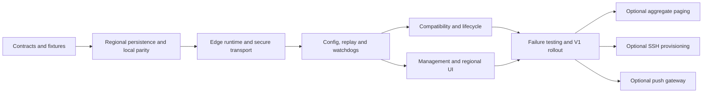

# Multi-region probes — implementation plan

Status: M0 and M1 are in progress; later milestones are planned. See [implementation status](IMPLEMENTATION_STATUS.md) for the tested subset and remaining work. Checkboxes describe whole work items, not partial progress. Application baseline, decisions, and reading order are in [README.md](README.md). Implement [ARCHITECTURE.md](ARCHITECTURE.md) and [PROTOCOL.md](PROTOCOL.md) as one contract.

## 1. Outcome and scope

Deliver a private hub that manages regional execution assignments and public probes that retain local monitoring and direct alerting through a hub/network outage. Preserve the default local installation and existing permissions, providers, monitor types, and database choices.

The engineering vertical slice is deliberately smaller than the V1 release: HTTP/TCP/DNS on one VM establish the persistence, trust, and alerting path. It is not ready for general use until the remaining compatibility and failure gates pass. The later SSH provisioner and push gateway are separately deployable improvements.

No time estimate in Gemini's four-sprint outline should be treated as validated. Re-estimate after M2 using measured migration cost, protocol throughput, and compatibility work. Track deliverable acceptance rather than declaring fixed sprint dates before the hard paths are implemented.

## 2. Dependency order



M4 and M5 may proceed concurrently only after the protocol/HTTP contract and backend response fixtures are frozen. Shared files have one owner. Do not let an implementation agent independently change a request name, status enum, event shape, migration number, or delivery policy.

## 3. M0 — freeze contracts and baseline fixtures

**Goal:** make the proposal unambiguous at the actual code boundaries before distributed behavior is added.

- [x] Re-read `AGENTS.md`, current `docs/ARCHITECTURE.md`, `docs/TESTING.md`, and these documents at the implementation branch HEAD.
- [x] Inventory current migrations in both adapters and reserve consecutive unused numbers. Migration `035_probe_registry` is reserved by the initial foundation after verifying both adapters ended at `034`. Recheck HEAD before reserving subsequent numbers.
- [x] Capture real monitor/heartbeat/template/maintenance/alert response fields in contract fixtures. Preserve `accepted_statuscodes`, `message`, `access_code`, and `monitor_ids` where applicable.
- [x] Define pure regional/probe types, stable identity formats, `UNKNOWN=4`, enums, and the atomic repository operations described in architecture section 3.
- [x] Define transport DTOs independently from domain types. Create valid/invalid fixtures under `internal/adapters/probe/testdata/v1/` and browser response fixtures in the existing frontend test layout.
  - Current-state/config DTOs and all transfer frames, bounded assembly, config reference/target/capability checks, all five telemetry event kinds, hello/welcome/health with trusted handshake comparison, command/enrollment/rotation-reset request and receipt DTOs, and admin/browser HealthView/assignment/ProbeView events are implemented, with 306 valid/invalid fixtures plus baseline HTTP/browser documents. Authenticated sessions/leases, config construction/extension validation, and atomic activation are not supplied by wire helpers.
- [x] Record a contract decision for any implementation discovery that changes this proposal, before dependent agents begin.
- [x] Capture baseline tests for retry confirmation, local recovery, maintenance, certificate alerts, capacity conditions, folder alerting, acknowledgement/escalation, and existing query counts.

**Acceptance:** fixtures encode all V1 message kinds and API responses; local-only source paths still compile and tests pass; no remote routes report success; no data migration or runtime flag has silently enabled remote work.

**Suggested commit:** `docs(core): freeze distributed probe contracts and fixtures` or a separate `test(core)` commit for executable fixtures.

## 4. M1 — regional persistence and local behavior parity

**Goal:** prove the core can handle multiple independent streams before opening a public listener.

- [x] Add `local` registration, monitor assignments/generations, regional state, stream cursor/receipt tables, scoped incident/delivery storage, config/command metadata, projection/history, and dirty-bucket schema.
  - Registration/assignments (`035`), regional observations/state/streams/commands/dirty buckets (`036`), incident/delivery mirrors (`038`), overall health projections (`039`), assignment/policy history (`040`), capacity/TLS assignment identity (`041`), local stream allocation (`042`), and availability attempt throttles (`043`) are in both engines. Existing `alerts` rows stay monitor-scoped. Edge SQLite schema remains M2.
- [ ] Add paired MariaDB/SQLite migrations and edge-schema migrations. Preserve existing heartbeat partition expression and IDs. Keep rollup auto-increment IDs; replace the old unique `(monitor_id,bucket)` key correctly.
  - Hub `036` regional tables, `037` heartbeat `probe_id` / rollup unique `(monitor_id,probe_id,bucket)`, `038` incident/delivery tables, `039` overall health projections, `040` assignment history, `041` capacity/TLS state, `042` local stream allocation, and `043` availability attempt throttles are paired. Edge schema remains M2.
- [x] Implement atomic regional commit and ingest transaction ports with real-engine tests; use a persisted sequence and state transaction on SQLite.
  - `RegionalCommitStore` commits observation+state together and ingest is idempotent with gap rejection. The `042` local path atomically allocates a shared stream sequence and writes heartbeat+observation+state+dirty buckets, with stale-evaluation retry. Local `HeartbeatService.Record` is wired; authenticated remote ingest and atomic incident/delivery integration remain later work.
- [x] Refactor shared retry/maintenance/condition evaluation into a reusable service operation. Keep the local scheduler routed through a `local` assignment.
  - `EvaluateObservation` applies maintenance then retry. `PromoteCondition` is the pure consecutive/hysteresis rule. `HeartbeatService.Record` uses both and commits local regional state. Incident dispatch remains on the existing dispatcher.
- [x] Make local/sharded scheduling assignment-aware. Existing DB leases distribute execution only within a logical vantage point; a local worker cannot claim a remote-only assignment.
- [x] Add regional readers and overall health policy evaluation. Preserve deterministic history ordering and UTC normalization at service/repository boundaries.
  - `ListStates` / windowed `ListObservations` and `MonitorHealthService.Current` evaluate ANY/ALL from complete assignment evidence. `History` reconstructs overall duration intervals from regional transitions, assignment effective times, and freshness.
- [ ] Scope alert throttling, certificate thresholds, capacity promotion, and escalation state. Preserve current single-local-monitor alert behavior.
  - `041` scopes capacity counters/cursors and certificate thresholds by probe and assignment generation. Local `Record` uses bound repository views; existing dashboard reads select current-local evidence. `043` persists availability attempt throttles with atomic resend reservations and local dispatcher wiring. Scoped alert lifecycle/escalation, atomic notification intents, remote rendering, and incident integration remain open.
- [x] Implement materialized current projections and historical dirty-bucket work so a regional read and an overall read have explicit semantics.
  - Migration `039` adds `monitor_health_state` / `monitor_health_history`. Regional commit/ingest mark 1m/1h/1d/overall dirty buckets. `ProjectCurrent` persists the current overall snapshot; `ProcessDirty` recomputes closed overall minutes. `040` persists assignment effective-time history for remove/re-add and policy reconstruction; assignment writes also mark the affected overall minute. Existing HTTP/browser mappings still do not emit UNKNOWN.

**Acceptance:** write interleaved local-UP/remote-DOWN observations and prove the remote retry counter reaches DOWN while local remains UP. Both same-second rows and per-region aggregates survive on MariaDB and SQLite. Empty/no-grant readers leak no data. With the feature disabled, the existing end-to-end local journey has unchanged behavior.

**Suggested commit series:** `feat(db): add regional probe state and migration contracts`; `refactor(core): evaluate health per probe`; `feat(core): derive overall monitor health`.

## 5. M2 — autonomous edge runtime and verified enrollment

**Goal:** run one probe without a hub database or frontend and establish authenticated communication.

- [ ] Add `cmd/probe/main.go`, edge bootstrap/config validation, dedicated SQLite migrations, process/data-directory lock, and stable TLS/identity files.
- [ ] Reuse current checker/notifier implementations. Enable and advertise HTTP/TCP/DNS for the engineering slice; reject unsupported assignments.
- [ ] Implement pinned TLS 1.3, required fingerprint validation, header credentials, locally generated enrollment token, crash-safe credential exchange, version negotiation, and endpoint policy.
- [ ] Implement a bounded one-reader/one-writer session supervisor, cancellation, limits, deadlines, fair control/replay scheduling, and backoff with jitter.
- [ ] Implement hub connector ownership with DB lease and fencing. Test old-session close callbacks and duplicate running probe identity.
- [ ] Implement direct regional delivery from a durable local outbox. Recording does not block on provider I/O.
- [ ] Add health/readiness diagnostics that remain meaningful during hub outage.

**Acceptance:** a manually initialized probe runs from an intact SQLite data directory; invalid/missing pins and wrong credentials fail closed; replayed enrollment cannot bind another hub; no auth, admin, or normal hub API is exposed on the probe. Restarting the agent retains its stream ID/sequence and accepted configuration.

**Suggested commits:** `feat(core): add autonomous probe runtime`; `feat(auth): add verified probe enrollment`; `feat(core): supervise fenced probe sessions`.

## 6. M3 — reliable synchronization, replay, and watchdogs

**Goal:** make partitions and lost acknowledgements ordinary recoverable states.

- [ ] Build complete per-probe snapshots from authorized assignments and dependencies. Changes persist desired revision and durable sync work.
- [ ] Implement chunked staging/hash validation, all-or-nothing activation, capabilities, generation handling, rejection reporting, and config acknowledgement after commit.
- [ ] Implement ordered telemetry batches, transactional cursor advancement, permanent rejection receipts, retryable failures, declared retention gaps, and bounded queues.
- [ ] Implement high-priority current-state snapshots without altering the historical cursor or emitting regional notifications.
- [ ] Implement per-assignment timestamp/sequence guards and dirty historical bucket recomputation.
- [ ] Implement both connection watchdogs, application-level hub-ingest health, startup arming, 90-second loss threshold, and 30-second recovery stabilization.
- [ ] Implement command persistence/idempotency, offline acknowledgement receipts, credential rotation, certificate rotation, and explicit stream-reset recovery.
- [ ] Implement queue pressure diagnostics and graceful shutdown with bounded flushing.

**Acceptance:** block the hub/probe link for 15 minutes, fail and recover a target during the partition, restart the probe, reconnect, and prove all retained history is ingested once with original times. Regional notifications come only from their owner, history replay emits none, current health recovers before the backlog fully drains, and a pending acknowledgement applies to the correct incident exactly once.

**Suggested commits:** `feat(core): synchronize versioned probe configuration`; `feat(db): ingest replayable probe telemetry`; `feat(core): persist probe watchdog and command state`.

## 7. M4 — existing-feature and operational compatibility

**Goal:** make distributed execution safe across Phoenix's actual feature surface.

- [ ] Cover all existing pull monitor types: `http`, `tcp`, `ping`, `dns`, `websocket`, `docker`, `mqtt`, `rabbitmq`, `grpc`, `snmp`, `database`, `s3`. Keep push local-only until M9.
- [ ] Advertise real runtime capability constraints, including ICMP privileges, Docker socket/API availability, engine support, and network/proxy bindings. Reject impossible assignments before activation.
- [ ] Synchronize maintenance schedules/timezones, direct monitor notification links, provider/template configuration, target visibility flags, tags/owner context, and effective escalation policies.
- [ ] Preserve direct-monitor and group-notification semantics: group channel attachments page on group incidents and are not automatically copied to every regional monitor.
- [ ] Preserve escalation precedence (direct monitor policy, then nearest ancestor group); a disabled assigned policy stops inheritance. Persist edge escalation steps and acknowledgement effect.
- [ ] Add per-probe TLS expiry and capacity history/state. Preserve `ok`, `warning`, `error`, derived `stale`, and two-sample promotion. Capacity warnings/errors keep availability UP.
- [ ] Update group/status-page recovery to use overall policy and fresh evidence. Preserve UNKNOWN through all readers, badges, incident automation, and chart models.
- [ ] Update Insights and navigation cache invalidation with projection versions; retain the current batched SQL/index paths and benchmark coverage.
- [ ] Extend config-as-code and backup/restore with stable probe keys and assignments. Keep secret references/write-only secrets out of ordinary exports. Restored remote identities remain disabled pending reenrollment.
- [ ] Define clear-history watermarks, soft-delete behavior, assignment removal/tombstones, stream retirement, and restored-hub/edge recovery procedures.
- [ ] Update operator deployment documentation and Helm feature flag/config/secret references. Preserve single-pod defaults and split-image behavior.

**Acceptance:** every existing supported feature has an explicit owner and regression test under remote execution; no UI or API quietly drops unsupported config. Migration from a pre-probe DB preserves local IDs/history/alerts, repeated config apply is idempotent, and restore never creates a duplicate live probe identity.

## 8. M5 — admin API and regional user experience

**Goal:** expose desired state, actual execution, and uncertainty clearly through the existing UI.

- [ ] Implement exact routes/DTOs in protocol section 7 with existing admin gates, AccessService checks, context user-ID helpers, and typed errors.
- [ ] Add fleet list/detail and manual enrollment forms, operation progress, credential/certificate expiry status, pause/revoke handling, and meaningful failed-operation states.
- [ ] Add probe selection to monitor create/edit, respecting non-admin local creation behavior and admin-only assignment changes. Explain pending configuration application after save.
- [ ] Add regional heartbeat strips and latency series to monitor detail, with separate connection status, check freshness, overall status, and coverage.
- [ ] Add region labels to incidents/notifications and pending acknowledgement UI. Do not claim remote suppression before command application.
- [ ] Add the new browser events through explicit wire maps and the existing Svelte rune store. Preserve monitor-level authorization on every fan-out and cache refresh.
- [ ] Public views show overall status/coverage without internal endpoint or regional inventory disclosure.
- [ ] Add English/Thai messages, responsive layouts, keyboard access, focus/error behavior, and accessible status labels beyond color.

**Acceptance:** admin can enroll and assign one VM, see two regional streams, disconnect the link, observe stale/unknown state and pending config/acknowledgement, and reconnect without a duplicate incident storm. A scoped non-admin sees only permitted monitors and safe regional metadata; cannot enumerate the fleet or mutate assignments.

## 9. M6 — failure validation and V1 activation

**Goal:** prove the guarantees on real persistence and a network boundary, then activate deliberately.

- [ ] Run the full matrix in section 13, including both hub database adapters and the pure-Go edge SQLite driver.
- [ ] Rehearse migrations on a populated partitioned MariaDB database. Record elapsed time, lock impact, peak disk growth, index validity, and rollback refusal conditions.
- [ ] Run bounded load cases: one probe/100 monitors; ten probes/1,000 total assignments; one shared monitor/ten probes; a 24-hour backlog draining while new checks arrive. Record hardware, intervals, row sizes, queue caps and p95 control/ingest delay; do not reuse local-only load claims as distributed proof.
- [ ] Prove replay drains faster than new events accumulate on the supported baseline while control health and scheduling stay responsive. Tune batch/rate limits from evidence.
- [ ] Run restart/kill tests around every durable boundary: local transaction, provider attempt, hub transaction, ACK, config activation, credential activation, and ownership takeover.
- [ ] Document required egress/listener rules, filesystem durability assumptions, clock synchronization, disk sizing, backup consistency, and notification-provider reachability.
- [ ] Verify all upgraded workers enforce assignment ownership before enabling remote monitoring.
- [ ] Run a canary with one noncritical monitor and one remote probe, then deliberate partition/recovery, then limited production enrollment using the operator's normal deployment approval process.

**Acceptance:** no unexplained lost acknowledged events, cross-region retry/recovery interference, duplicate persisted telemetry, replay pages, unauthorized result writes, or falsely successful config/provisioning responses. Known external provider duplicate-delivery windows and bounded-retention loss are visible and documented.

## 10. Follow-on M7 — optional consolidated paging

- [ ] Add explicit `aggregate` and `both` delivery modes after V1 `regional` mode is stable.
- [ ] Persist hub-owned aggregate incident identity, provider intents, deduplication, throttle, and ownership fencing.
- [ ] Implement ANY/ALL truth-table tests with missing, stale, paused, maintenance, and recovering probes.
- [ ] Reconcile a current fresh snapshot without replaying old aggregate incident transitions; administrative policy changes receive administrative closure reasons.
- [ ] Explain regional versus aggregate scope in channel configuration and alert messages.

**Acceptance:** an operator explicitly selects each mode and receives only the configured scopes; UNKNOWN never creates a fake recovery or satisfies ALL-DOWN quorum.

## 11. Follow-on M8 — optional SSH provisioning

- [ ] Add admin-only asynchronous operation routes and an idempotent installer service behind a provisioning port.
- [ ] Verify host keys through known-hosts or an explicit verified fingerprint. Support a temporary deployment key; avoid persistent passwords/private keys in the hub database.
- [ ] Detect OS/architecture/runtime, select a version-pinned artifact, verify integrity, create persistent identity/data/secret paths, and install Docker or a complete systemd unit.
- [ ] Preserve unrelated host resources and make rerun behavior explicit. Track resources created by the operation so partial failure can be diagnosed and intentionally cleaned up.
- [ ] Stream redacted output with bounded retention, cancellation, exit status, and failed phase. Do not print enrollment/runtime tokens into the UI terminal.
- [ ] Finish only after verified runtime enrollment and successful config activation. Keep remote application update/rollback separate from initial install.

**Acceptance:** supported clean host, existing install, interrupted install, missing sudo, bad host key, wrong architecture, inaccessible runtime port, and non-Docker systemd path all have tested outcomes. No failure branch returns success.

## 12. Follow-on M9 — optional public push gateway

- [ ] Define regional push ownership and timeout behavior separately from pull scheduling.
- [ ] Reuse existing push/HMAC auth, with request body limits, rate limits, replay defense, safe logs, and per-assignment authorization.
- [ ] Persist accepted push evidence before acknowledging it, then relay with the same durable telemetry protocol.
- [ ] Specify a public certificate trust/deployment solution usable by ordinary clients, separate from hub-only fingerprint pinning.
- [ ] Define whether the push's source observation time is trusted and how delayed relays affect missed-beat detection and current health.

**Acceptance:** a private hub receives external push history through a VM, offline buffering survives restart, duplicate pushes and relays do not inflate uptime, and the public endpoint exposes no hub management function.

## 13. Required verification matrix

| ID | Scenario | Required assertion |
|---|---|---|
| T01 | Two probes disagree repeatedly | Separate counters/incident identities; one UP cannot recover the other's DOWN |
| T02 | Same-second MariaDB heartbeats | Correct regional ordering with deterministic tie-break; no stale latest state |
| T03 | SQLite and MariaDB rollup migration | Local rows preserved; same monitor/bucket accepts both probe rows; auto-increment keys remain valid |
| T04 | ACK lost after hub commit | Repeated batch creates no duplicate history, incidents, aggregates, or delivery intents |
| T05 | Hub commit fails before ACK | Cursor unchanged; retry persists once when storage recovers |
| T06 | Probe killed around local commit | State, sequence, observation, and notification intent are all committed or all absent |
| T07 | Hub link lost for 15 minutes | Probe checks and local notifications continue; hub evidence ages to UNKNOWN |
| T08 | Target fails and recovers entirely offline | History preserves real times; reconnect sends no stale regional DOWN/recovery pages |
| T09 | Current snapshot ahead of backlog | Current projection stays at newer sequence while old history catches up |
| T10 | Probe restarts disconnected | Accepted config/incident/throttle/escalation/stream identity survive |
| T11 | Socket alive, hub DB unavailable | No false ingestion ACK; independent application watchdog detects sustained failure |
| T12 | Rapid disconnect/reconnect | Loss/recovery debounce works; old session close cannot invalidate new session |
| T13 | Config interrupted or hash wrong | Prior complete config remains active; desired/applied revisions diverge visibly |
| T14 | Assignment removed with in-flight work | Old generation cannot mutate current health; retained valid history is handled explicitly |
| T15 | Monitor/probe deleted or revoked | No history resurrection, unauthorized assignment writes, or reconnect acceptance |
| T16 | Token/pin missing, wrong, expired, or replayed | Enrollment/session fails closed; no secret emitted in errors/logs |
| T17 | Credential/certificate rotation loses final response | Prepared durable identity recovers; validation never disabled |
| T18 | Large/malformed/unsupported messages | Bounded memory, typed rejection, no stalled unbounded goroutines |
| T19 | Queue byte/age retention exceeded | Explicit durable gaps, bounded disk usage, reduced coverage; no silent loss claim |
| T20 | Disk full during critical commit | Probe reports persistence unhealthy and does not claim successful durable recording |
| T21 | Clock skew and backward wall clock | UTC bounds, sequence-based state, nonnegative intervals, visible skew diagnostic |
| T22 | Historical events arrive outside normal rollup lookback | Dirty buckets recomputed through 1m/1h/1d and overall history |
| T23 | Maintenance crosses DST/offline restart | Existing timezone/cron semantics honored; alerts suppressed by actual IsActive behavior |
| T24 | Capacity or certificate differs by region | Independent state/promotion/threshold; capacity never changes heartbeat to DOWN |
| T25 | Offline acknowledgement then a new outage | Only original incident acknowledged; UI pending until effect applied |
| T26 | Provider accepts then probe crashes | Stable intent identity; any unavoidable external duplicate window documented and observable |
| T27 | Queued old DOWN after recovery | Obsolete intent superseded by delayed incident summary |
| T28 | Two hub connector owners / lease expiry | Generation fencing prevents stale config/commands; no duplicate local execution |
| T29 | Two probe processes share/copy identity | Local lock or duplicate-session rejection; no corrupt sequence reuse |
| T30 | Partial monitor grants and revoked permissions | HTTP/WS regional data scoped; hidden monitor returns 404; no fleet leakage |
| T31 | ANY/ALL with UNKNOWN/PENDING/maintenance | Exact architecture truth table; UNKNOWN never closes confirmed incident |
| T32 | Different probe intervals/counts | Overall uptime is duration/policy-based, unaffected by raw sample pooling |
| T33 | Feature disabled and legacy local-only install | Existing local journey, permissions, alert lifecycle, and JSON names preserved |
| T34 | Mixed-version workers during upgrade | Remote activation blocked until all workers honor assignments |
| T35 | Backup restore and edge data rollback | Explicit stream/fencing reset; no duplicate live identity or reuse of old sequence IDs |
| T36 | Clear history then replay old queue | Clear watermark prevents resurrecting removed evidence |
| T37 | High-volume replay plus new checks/config | Bounded queues, fair control traffic, no scheduling starvation, drain makes progress |
| T38 | Group incident recovery with one region still down | Overall policy governs resolution; regional recovery cannot close wrong incident |
| T39 | Disabled inherited escalation policy | Does not fall through and page another group; step zero remains dispatcher-owned |
| T40 | Scope/template redaction | Existing alert.scope meaning preserved; probe fields additive; no DSN/provider secrets leak |

Do not replace the real-engine/crash cases with fakes that compare instants or return success without mutation. Pure service fakes are appropriate for policy tests; they are insufficient for partition-key, transaction, timestamp-precision, or disk-durability assertions.

## 14. File ownership and parallel-agent handoff

This table is a future implementation assignment, not a statement that agents have been launched. Before delegation, the integrator chooses actual owners and freezes exact new filenames within each directory. Tests accompanying an owned production file share its owner. No other owner edits that file until handoff.

| Owner | Exclusive surfaces | Dependencies |
|---|---|---|
| Integrator/contracts | `internal/core/domain/**`, `internal/core/ports/**`, `internal/bootstrap/**`, `cmd/**`, `internal/adapters/http/router.go`, `internal/adapters/ws/**`, `go.mod`, `go.sum`, `Makefile`, `Dockerfile*`, `charts/**`, shared documentation and fixtures | M0 first; receives adapter/service implementations through stable contracts |
| Persistence | `internal/adapters/repository/**`, including paired hub migrations, dedicated edge schema, source models and engine tests | Frozen core ports/types; integrator reserves migration numbers |
| Core behavior | `internal/core/services/**`, `internal/adapters/scheduler/**`, associated tests | Regional atomic repository ports; does not edit types/ports without integrator handoff |
| Probe transport | `internal/adapters/probe/**`, new dedicated credential adapter files under `internal/adapters/auth/probe_*`, transport unit/integration tests | Frozen DTOs and lease/credential/ingest ports; DTO fixtures transferred explicitly from integrator when editing needed |
| HTTP API | `internal/adapters/http/handlers/**` and new scoped middleware tests; existing shared middleware production edits coordinated through integrator | Frozen service and response contracts; router remains integrator-owned |
| Frontend | `web/**`, including API clients, Svelte rune stores, routes/components, i18n and Playwright tests | Checked-in response fixtures; no independent field-name changes |
| Read-only review | One assigned report under `docs/local/` with a unique filename | Reads source, edits only its report; reports do not substitute for integrator verification |

Use at most the available agent slots. These are logical ownership tracks, not a requirement to run seven agents simultaneously. Persistence and core can work after M0; transport can follow stable ports; HTTP and frontend can overlap after response fixtures exist. Integrator verifies every reported result and runs the full gate after integration.

An implementation task handed to another agent must contain: baseline commit, milestone and acceptance IDs, exact owned files, required contract documents, dependencies already landed, commands to run, and a prohibition on expanding monitor/provider/permission dimensions. End the task with changed files, evidence, and unresolved contract decisions.

## 15. Validation commands and documentation checks

For implementation, run the applicable commands from `docs/TESTING.md`; shell commands use the repository's RTK prefix. The core release gate includes:

```bash
rtk go build ./...
rtk go test -race -count=1 ./...
rtk golangci-lint run
rtk proxy make gate-full
```

When operating in `web/`, use Bun exclusively for `bun run check`, `bun run test`, `bun run build`, and `bun run lint`. Use `helm lint charts/uptime-phoenix` and template tests when chart changes land. Run the configured MariaDB contract against a disposable real DB as described in the project testing guide; the full local gate alone does not supply that DB.

For this documentation-only handoff, verify relative links, balanced code fences, JSON examples, consistent decision/status names, source references, research provenance, and `git diff --check`. No runtime proof is implied by validating documentation.

## 16. Rollout and stopping conditions

1. Land contracts and additive migrations with remote execution disabled.
2. Upgrade all local workers/readers and verify local parity before allowing remote assignments.
3. Enable probe capability for admins with one manual canary; verify TLS/credential storage and real network permissions.
4. Run a deliberate outage, source restart, and replay test before expanding to important targets.
5. Increase probe count and assignment load only while queue age, projection delay, and provider failure metrics remain within the measured envelope.
6. Keep a compatible binary and verified backup available. Disabling the feature must not cause remote-only work to be claimed locally; disable scheduling explicitly before any old-binary rollback.

Stop rollout on lost acknowledged data, cross-probe state interference, incorrect assignment authorization, empty-pin acceptance, duplicate source identity, unbounded disk growth, or a success response without the documented effect. Record evidence and fix the failing acceptance test before resuming. Notification-provider delivery ambiguity and retention gaps are acceptable only within the explicit documented limits and with operator-visible state.

## 17. Start instruction for the next agent

Continue from [IMPLEMENTATION_STATUS.md](IMPLEMENTATION_STATUS.md) on the shared branch. Read the design documents and project instructions, confirm HEAD and the next migration number, finish the remaining M0 contracts/fixtures, and extend the existing M1 foundation without enabling remote execution. The first foundation already captures the local baseline; do not recreate or overwrite those types, fixtures, or migration 035. Keep each milestone reviewable and commit its contract, code, and tests together. Do not start SSH provisioning or the public push gateway until the V1 monitoring/replay path has passed M6.
